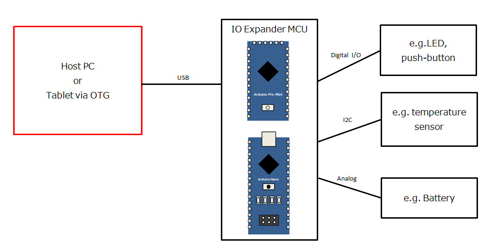

android-ioexpander-host-sample
====

Android Host Sample Application for [arduino-ioexpander-fw](https://github.com/bigw00d/arduino-ioexpander-fw)

## Overview

## Requirement

- Android Studio (Version: 3.3.2)
- Nexus 7 (2013)

## Usage
1. Programming arduino-ioexpander-fw to your IO expander device (see [arduino-ioexpander-fw](https://github.com/bigw00d/arduino-ioexpander-fw))
2. Connecting Android device to IO expander device(see [arduino-ioexpander-fw](https://github.com/bigw00d/arduino-ioexpander-fw))
3. Start IO expander device
4. Start Android Application

## Licence

   Copyright (c) 2020 Daiki Yasuda
   Released under the MIT license
